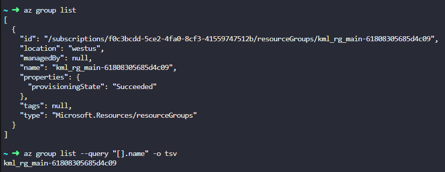
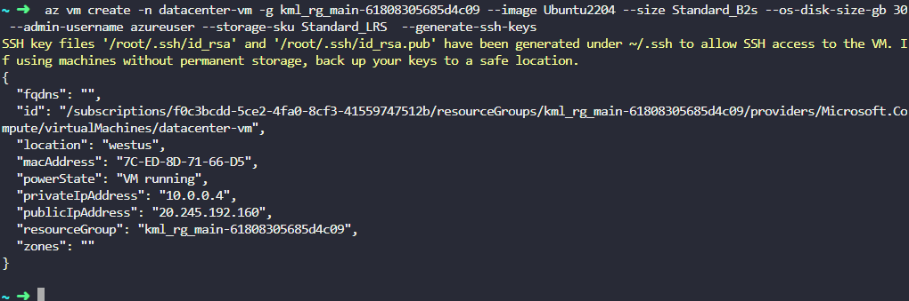
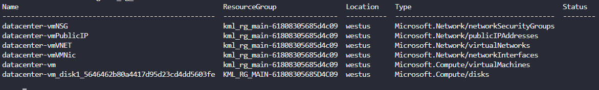
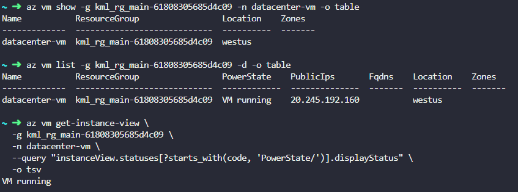

The Nautilus DevOps team is in the process of migrating some of their workloads to Azure. One of the tasks involves creating a new Virtual Machine (VM) using the Azure CLI. The team does not have access to the Azure portal but can manage Azure resources via the `azure-client` host (the landing host for this lab).

1) Create a new Azure Virtual Machine named `datacenter-vm` using the Azure CLI.

2) Use the `Ubuntu2204` image and set the VM size to `Standard_B2s`.

3) Make sure the admin username is set to `azureuser` and SSH keys are generated for secure access.

4) Use `Standard_LRS` storage account, disk size must be `30GB` and ensure the VM `datacenter-vm` is in the `running` state after creation.

<details>
    <summary> how to use `az account show` command, to check resource groups </summary>

**how to use `az account show` command, to check resource groups**

Good question — **`az account show` won’t list resource groups.**
That command only shows details about the **current Azure subscription** (like subscription name, ID, tenant, etc.).

Example:

```bash
az account show
```

You’ll see something like:

```json
{
  "id": "xxxxxxxx-xxxx-xxxx-xxxx-xxxxxxxxxxxx",
  "name": "Pay-As-You-Go",
  "tenantId": "...",
  "user": { ... }
}
```

---

## ✅ To check (list) resource groups, use:

```bash
az group list
```

That prints all RGs in your current subscription.

To see only names (cleaner):

```bash
az group list --query "[].name" -o tsv
```

---

## 🔎 If you want to list resource groups in a **specific subscription**

First switch to that subscription (if needed):

```bash
az account set --subscription <SUBSCRIPTION-ID-OR-NAME>
```

Then:

```bash
az group list -o table
```

---

### Quick summary

| Task                   | Command                                   |
| ---------------------- | ----------------------------------------- |
| Show subscription info | `az account show`                         |
| List resource groups   | `az group list`                           |
| Pretty table output    | `az group list -o table`                  |
| Switch subscription    | `az account set --subscription <id/name>` |

</details>

---

> IMP: `az vm create -h | less`

---

```bash
az vm create -n datacenter-vm -g kml_rg_main-61808305685d4c09 --image Ubuntu2204 --size Standard_B2s --os-disk-size-gb 30
 --admin-username azureuser --storage-sku Standard_LRS  --generate-ssh-keys

```

---

`az group list --query "[].name" -o tsv`

`az group show -g kml_rg_main-61808305685d4c09 -o table`


`az resource list -g kml_rg_main-61808305685d4c09 -o table`


---

<details>
  <summary>if want to see resources? </summary>


Sure — if you want to **see the resources inside a resource group**, use:

### ✅ List all resources in a resource group

```bash
az resource list -g kml_rg_main-61808305685d4c09 -o table
```

This shows everything:

* VMs
* NICs
* Disks
* Public IPs
* NSGs
* etc.

---

## 👍 Common focused views (optional)

### 👀 Only VMs

```bash
az vm list -g kml_rg_main-61808305685d4c09 -o table
```

### 👀 Only disks

```bash
az disk list -g kml_rg_main-61808305685d4c09 -o table
```

### 👀 Only public IPs

```bash
az network public-ip list -g kml_rg_main-61808305685d4c09 -o table
```

---

### 🔎 Tip

To discover commands:

```bash
az resource -h
```

or for VMs:

```bash
az vm -h
```

---


</details>

---

Validation:

```shell
az vm show -g kml_rg_main-61808305685d4c09 -n datacenter-vm -o table

az vm list -g kml_rg_main-61808305685d4c09 -d -o table

az vm get-instance-view \
  -g kml_rg_main-61808305685d4c09 \
  -n datacenter-vm \
  --query "instanceView.statuses[?starts_with(code, 'PowerState/')].displayStatus" \
  -o tsv
```
