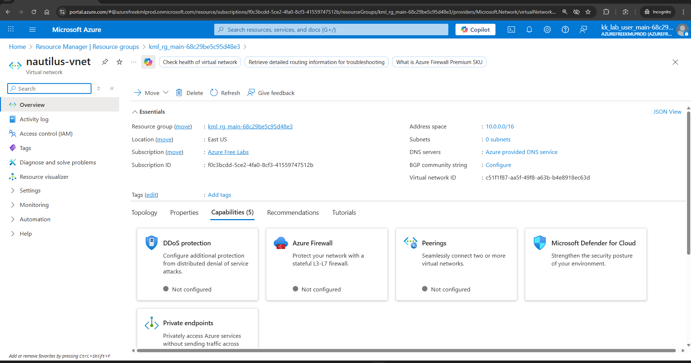

Create a Virtual Network (VNet) named `nautilus-vnet` in the `East US` region with any `IPv4` CIDR block.

```json
~ ➜  az group list
[
  {
    "id": "/subscriptions/f0c3bcdd-5ce2-4fa0-8cf3-41559747512b/resourceGroups/kml_rg_main-68c29be5c95d48e3",
    "location": "westus",
    "managedBy": null,
    "name": "kml_rg_main-68c29be5c95d48e3",
    "properties": {
      "provisioningState": "Succeeded"
    },
    "tags": null,
    "type": "Microsoft.Resources/resourceGroups"
  }
]
```

```json            
~ ➜  az network vnet create -n nautilus-vnet  -l eastus --address-prefixes 10.0.0.0/16 -g kml_rg_main-68c29be5c95d48e3
{
  "newVNet": {
    "addressSpace": {
      "addressPrefixes": [
        "10.0.0.0/16"
      ]
    },
    "enableDdosProtection": false,
    "etag": "W/\"0127c9af-799d-4fad-b62b-b51605c5ba6f\"",
    "id": "/subscriptions/f0c3bcdd-5ce2-4fa0-8cf3-41559747512b/resourceGroups/kml_rg_main-68c29be5c95d48e3/providers/Microsoft.Network/virtualNetworks/nautilus-vnet",
    "location": "eastus",
    "name": "nautilus-vnet",
    "privateEndpointVNetPolicies": "Disabled",
    "provisioningState": "Succeeded",
    "resourceGroup": "kml_rg_main-68c29be5c95d48e3",
    "resourceGuid": "c51f1f87-aa5f-49f8-a63b-b4e8918ec63d",
    "subnets": [],
    "type": "Microsoft.Network/virtualNetworks",
    "virtualNetworkPeerings": []
  }
}
```
